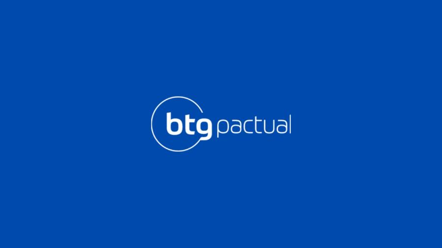
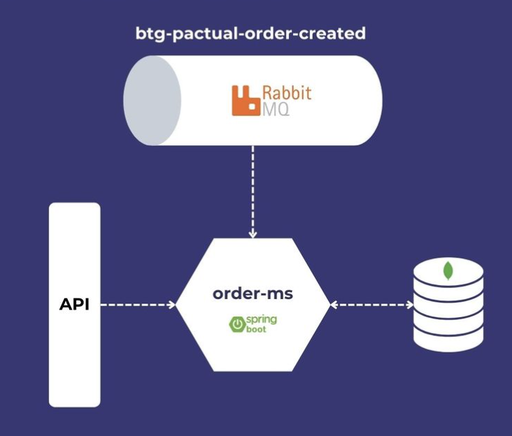

     

<h3 align="center">
  Desafio Backend do BTG Pactual
</h3>

  
  
  

Desafio orientado pelo [video](https://www.youtube.com/watch?v=e_WgAB0Th_I) do canal **[Build & Run](https://www.youtube.com/@buildrun-tech)**

## Desafio
- Confira o enunciado completo, [clicando aqui](./problema-btg.md).

## Diagrama de funcionamento

     

## Detalhes sobre as ferramentas utilizadas:
- Para interagir com o banco de dados: [MongoDB Compass](https://www.mongodb.com/products/tools/compass)
- Para interagir com a API: [Bruno](https://github.com/usebruno/bruno)

## Tecnologias utilizadas
* Java 17
* Spring Boot
* Spring Data MongoDB
* RabbitMQ
* Docker

## Créditos:
Developed by @Build & Run